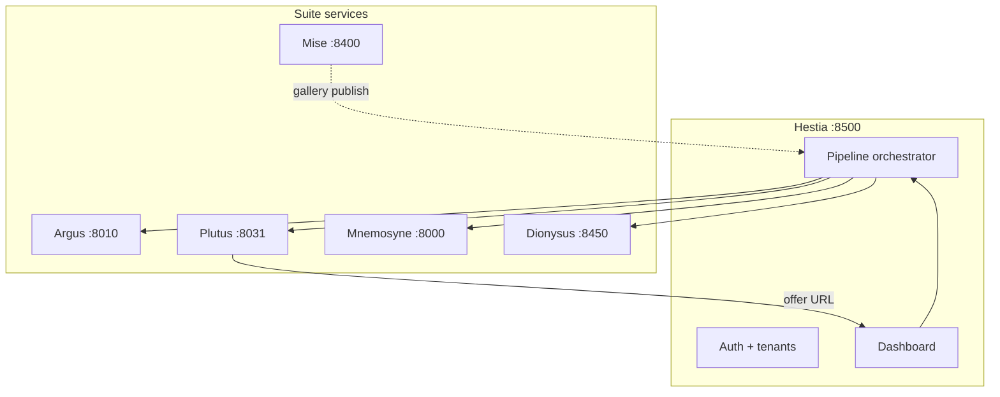

# Hestia

**The hearth of the photography studio** — one SaaS platform for all photographers: deliver
galleries, run AI vision on every image, and turn each delivery into print and album revenue.

> **For AI agents:** This README is the canonical project brief. Read it fully before editing
> code or proposing architecture. Phase scope lives in [`docs/PHASE-0.md`](docs/PHASE-0.md).
> Suite integration contracts are in [`docs/SUITE.md`](docs/SUITE.md).

---

## Status

| Item | State |
|------|--------|
| Repo | Bootstrapping — shell not yet implemented |
| Phase | **0** — prove orchestrated pipeline before billing/signup |
| Audience | All professional photographers (horizontal product) |
| Signup | Invite-only (`HESTIA_SIGNUP_ENABLED=false` by default) |
| Port | **8500** |

---

## One-liner

**Deliver galleries → AI understands every image → client buys prints/albums — one login, one pipeline.**

---

## What Hestia is (and is not)

### Hestia IS

- The **unified SaaS shell**: auth, tenants, onboarding, dashboard, billing scaffold, pipeline orchestration.
- The **hearth** where suite services connect — hospitality metaphor (clients gather here).
- A **horizontal** product: wedding, portrait, commercial, event, and food photographers use the same app; **shoot-type presets** enable optional modules.

### Hestia IS NOT

- A rewrite of Mise, Argus, Plutus, Mnemosyne, or Dionysus.
- A gallery host on day one (uses existing services).
- A niche F&B-only product (food is one shoot type, not the brand).

---

## Core loop (universal)

Every shoot type gets this path in Phase 0:

```text
Gallery source → Argus (vision) → Plutus (bundles + offer link) → client checkout
```

Optional modules (feature-flagged by shoot type):

```text
Mnemosyne (album drafts)     — wedding, event
Dionysus (campaign copy)     — commercial, food
Mise (full studio OS / CRM)  — Phase 2
```

---

## Suite map

Hestia orchestrates existing repos via HTTP. **Do not copy their code into a monolith** until
Phase 0 magic is proven.

| Service | Repo | Default port | Role |
|---------|------|--------------|------|
| **Hestia** | `github.com/Ayyitskevin/hestia` | 8500 | Shell: auth, tenant, pipeline, UI |
| Mise | `github.com/Ayyitskevin/mise` | 8400 | Studio OS: CRM, galleries, site, money |
| Argus | `github.com/Ayyitskevin/argus` | 8010 / 8020 | Vision: keywords, culling, hero scores |
| Plutus | `github.com/Ayyitskevin/plutus` | 8030 / 8031 | Print/album upsell, Stripe checkout |
| Mnemosyne | `github.com/Ayyitskevin/mnemosyne` | 8000 | Album spread drafts |
| Dionysus | `github.com/Ayyitskevin/dionysus` | 8450 | Campaign copy, shot lists, captions |



**Reference E2E (today):** `plutus/scripts/dogfood-suite-loop.sh` on the operator fleet.

---

## Shoot-type presets

Implement in `hestia/features.py`. Same product; modules toggle by tenant `shoot_type`.

| `shoot_type` | Mnemosyne | Dionysus | Mise CRM |
|--------------|-----------|----------|----------|
| `wedding` | on | off | Phase 2 |
| `event` | on | off | Phase 2 |
| `portrait` | off | off | Phase 2 |
| `commercial` | off | on | Phase 2 |
| `food` | off | on | Phase 2 |
| `other` | off | off | Phase 2 |

---

## Phase discipline

| Phase | Goal |
|-------|------|
| **0** | Orchestrate Mise gallery (or upload batch) → Argus → Plutus offer; dashboard stepper; dogfood script; CI smoke |
| **1** | Unified Stripe subscription; upload-without-Mise; optional public signup |
| **2** | Mise CRM module; white-label domains; deeper embedded UIs |

**Phase 0 OUT:** public signup floodgate, multi-tenant Mise rewrite, production WHCC, replacing sibling admin UIs.

Details: [`docs/PHASE-0.md`](docs/PHASE-0.md)

---

## Planned stack & conventions

Match the Kevin Lee photography suite patterns:

| Layer | Choice |
|-------|--------|
| Runtime | Python 3.12+, FastAPI, uvicorn |
| UI | Jinja2 + HTMX (warm, clean — not generic purple SaaS) |
| Control-plane DB | SQLite → optional Postgres later |
| HTTP clients | httpx, typed per service under `hestia/clients/` |
| Auth | Session cookies (UI); `hestia_tk_<tenant>_<secret>` bearer (API) |
| Config | `python-dotenv`, `.env.example`, no secrets in repo |
| Ops | `scripts/dogfood-hestia.sh`, `scripts/ci-smoke.sh`, `/healthz` |
| CI | GitHub Actions `ci-smoke` (ruff + pytest), like plutus |

### Planned layout

```text
hestia/
  main.py config.py auth.py tenants.py pipeline.py features.py db.py
  clients/   mise.py argus.py plutus.py mnemosyne.py dionysus.py
  routes/    admin.py api.py pipeline.py health.py
  templates/ landing.html dashboard.html pipeline.html admin/
  scripts/   dogfood-hestia.sh ci-smoke.sh start-hestia.sh
  docs/      PHASE-0.md SUITE.md architecture.md
  tests/
```

---

## Environment variables

```bash
HESTIA_PORT=8500
HESTIA_SAAS_MODE=true
HESTIA_SIGNUP_ENABLED=false
HESTIA_DATA_DIR=./data
HESTIA_API_TOKEN=CHANGE_ME_ADMIN
HESTIA_TENANT_KEY_PEPPER=CHANGE_ME
HESTIA_SESSION_SECRET=CHANGE_ME
HESTIA_PUBLIC_URL=http://127.0.0.1:8500

# Default service URLs (overridable per tenant in DB)
HESTIA_MISE_URL=http://flow:8400
HESTIA_ARGUS_URL=http://127.0.0.1:8010
HESTIA_PLUTUS_URL=http://127.0.0.1:8031
HESTIA_MNEMOSYNE_URL=http://127.0.0.1:8000
HESTIA_DIONYSUS_URL=http://127.0.0.1:8450
```

---

## Pipeline contract (Phase 0)

**Trigger:** `POST /api/pipeline/run`

```json
{
  "source": "mise_gallery",
  "source_id": "1"
}
```

**Steps (persisted, idempotent):**

1. `vision` — Argus analyze or attach existing run
2. `recommend` — Plutus recommend + mint share/offer link
3. `album` — Mnemosyne import (if shoot type enables)
4. `campaign` — Dionysus pack (if shoot type enables)

Re-run on the same `source_id` must **update** the existing pipeline run, not duplicate offers.

**Status:** `GET /api/pipeline/runs/{id}` — stepper JSON for UI.

---

## Magic moment (success criterion)

An operator publishes a real gallery and within minutes sees in Hestia:

- Vision step complete (Argus)
- A live Plutus offer URL ready to send to the client
- Optional album/campaign steps queued or complete per shoot type

If that does not feel faster than running five separate tabs, Phase 0 is not done.

---

## Rules for AI contributors

1. **Read** `docs/PHASE-0.md` and `docs/SUITE.md` before large changes.
2. **Orchestrate** sibling services via HTTP clients — do not vendor their codebases in Phase 0.
3. **Fail gracefully** — Dionysus/Mnemosyne down must not block Argus → Plutus.
4. **Idempotent pipelines** — no duplicate Stripe offers or share links on retry.
5. **No scope creep** — CRM, public signup, and unified billing are Phase 1+ unless explicitly requested.
6. **Match suite style** — same auth patterns as plutus, same phase IN/OUT docs as argus/plutus.
7. **Dogfood first** — `scripts/dogfood-hestia.sh` must pass on the operator fleet before claiming done.
8. **Document assumptions** in `docs/` when you make product or integration decisions.

---

## Operator fleet (dogfood)

Kevin Lee Photography runs a homelab fleet used for integration dogfood:

| Host | Typical service |
|------|-----------------|
| `flow` | Mise `:8400`, production site `kleephotography.com` |
| local / `strix-halo` | Plutus SaaS `:8031`, Argus `:8010`, Mnemosyne `:8000`, Dionysus `:8450` |

Hestia dogfood targets this fleet; CI uses mocked HTTP clients.

---

## Related reading

| Doc | Purpose |
|-----|---------|
| [`docs/PHASE-0.md`](docs/PHASE-0.md) | IN/OUT scope, first PR checklist |
| [`docs/SUITE.md`](docs/SUITE.md) | Sibling repo integration endpoints & tokens |
| [`docs/architecture.md`](docs/architecture.md) | Module diagram and data flow |
| [plutus PHASE-0](https://github.com/Ayyitskevin/plutus/blob/main/docs/PHASE-0.md) | Phase discipline template |
| [argus ROADMAP](https://github.com/Ayyitskevin/argus/blob/main/docs/ROADMAP.md) | Vision service north star |

---

## License

TBD — suite is under active development by [Kevin Lee](https://github.com/Ayyitskevin).